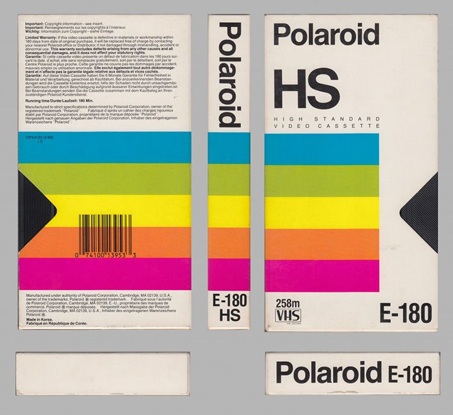
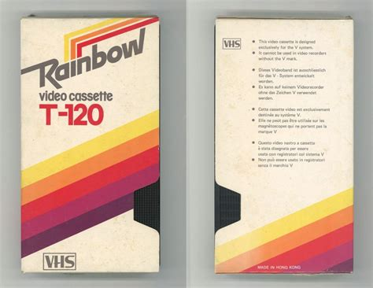
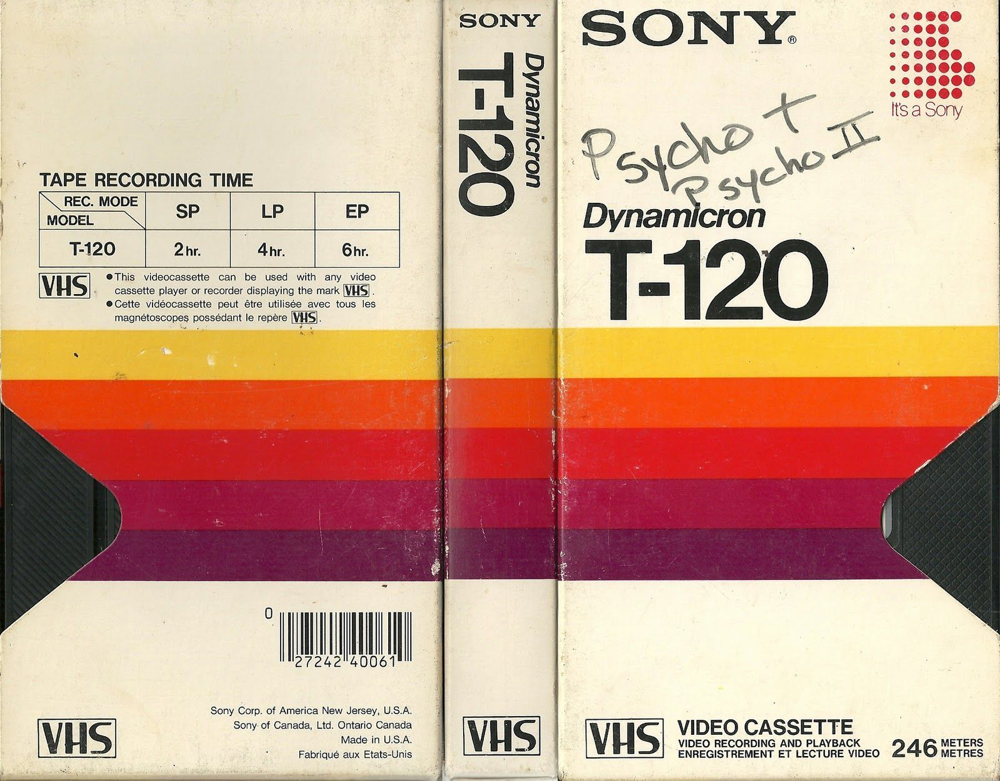
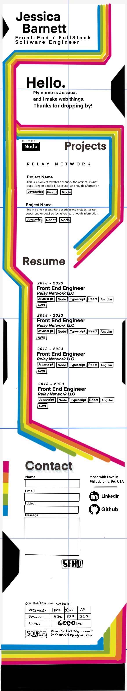

JessicaBarnett.github.io
========================

Personal Landing Site
test

## Design Phase

I have a friend who recently bought a VCR, and has been enjoying watching all kinds of movies on it.  The nostalgia of the blue screen with the numbers, the static, the packaging, and that grainy quality is just something that's hard to find anywhere else.

So when I started looking for inspiration for this new design, I ended up looking at packaging for retro Blank VHS casettes.

| Polaroid      | Rainbow      |  Sony      |
| ------------- | ------------- | ------------- |
|  |  |  |

I know full well that I'm not the best designer, and this is partly because I **really** like bright obnoxious colors.  And I **really** liked that Polaroid Casette!

With inspiration in hand, I went about making my design.  It started with a bunch of chicken scratch in a notebook, as all good things do.

Then It came time to start making something more hi fidelity, which means getting into design software.  Unfortunately all the standard design tools have Subscription costs, and I'm quite judicious about where I put my money these days.  Hence I ended up using my artist workhorse procreate to bring life to my design, even though both Sketch and Figma are much easier to work with (particularly when it comes to text).

It turned out pretty well all things considered. This is a 580px canvas, initially meant for phones.  But I think I made things a bit too small, so it's more of a 725 px layout.

I know I'll have to make adjustments.  But at least now I have an idea of what I'm aiming for.  The real fine-tuning happens in the browser.

